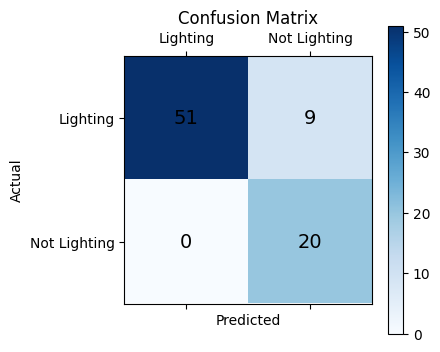

# Lighting Classifier

A Random Forest model that parses pdf documents, classifies and predicts whether the pdf is for a lighting product or not.

The RF model achieves **88.75%** accuracy on test dataset.

Below is the confusion matrix for test dataset



### Setup
- Create conda environment

    ```bash
    conda create --name test_par python=3.10
    ```

- Activate environment

    ```bash
    conda activate test_par
    ```

- Install the required libraries 

    ```bash
    pip install -r requirements.txt
    ```

### Usage
- Get results (URL or local pdf file)

     ```
     python predict.py --filepath “URL or local path to file” 
     ```

### Training

-  Dataset:

    Download and process text in pdf files.

    ```bash
    ./data_processor.sh
    ```

- Train text classifier :

    ```
    python train.py 
    ```

- Run evaluation on Test data : 

    ```
    python eval.py
    ```


